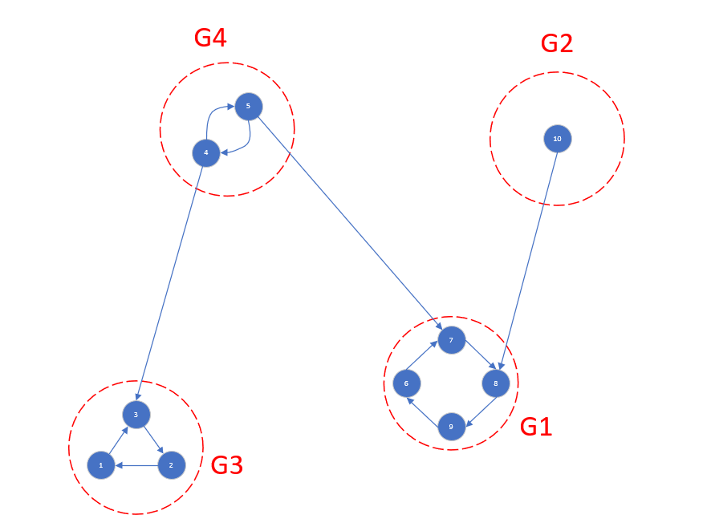
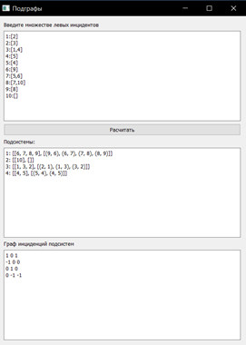
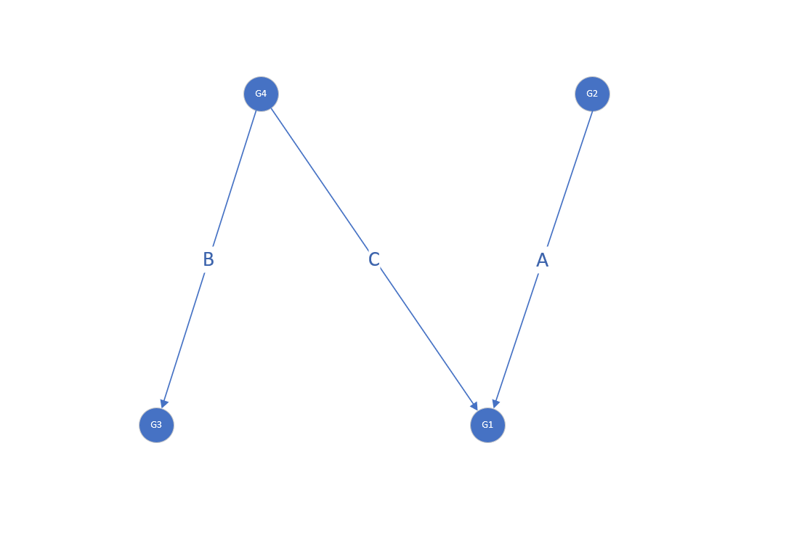

# -Graphs-and-graph-subsystems

Программа выделяет подсистемы из множества левых инциденций (выписывает номер подсистемы и из каких вершин и ребер состоит).  
Далее программа строит матрицу инциденций отношений этих подсистем.  

Пример работы

 

  

  

 
